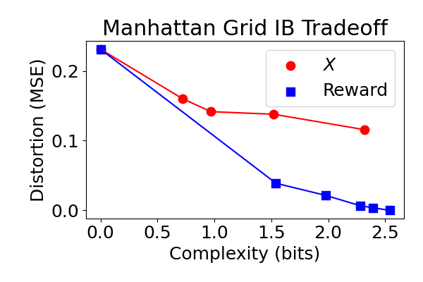

# explanation_abstractions
Code for "An Information Bottleneck Characterization of the Understanding-Workload Tradeoff" by Sanneman, Tucker, and Shah.

This code heavily leverages an existing IB library (embo) to generate abstractions along the IB tradeoff curve of complexity and task distortion.

## Setup:
### Install all the required packages

Install the packages listed under requirements.txt. We assume you're running Python 3.8.

### Adding the color subrepo:
We use the WCS dataset for our color domain experiments. You can load such data, and associated models, from an existing github repo that has done work in this area:

> git submodule add --force https://github.com/nogazs/ib-color-naming ib_color_naming

Be sure to cite Noga Zaslavsky's associated work (described in that repo).

### Adding embo
We depend heavily upon the embo package for IB tradeoffs. Normally, one may install embo via package managers like pip, but we modified the source code to expose additional information.
Therefore, add a submodule for the forked embo code via

> git submodule add --force https://github.com/mycal-tucker/embo-github-mirror.git embo

There are only minor differences compared to the original embo code, so please cite their work: https://github.com/epiasini/embo-github-mirror

## Running the code!

We assume all code is run from this repo's directory with the relevant virtual environment activated. For example,

> cd ~/userXXX/src/explanation_abstractions
> 
> conda activate ib_explanations
> 
> python src/scripts/exact_grid_ib.py

This moves into the repo, activates the environment (assuming you have installed packages in a virtual environment named ``ib_explanations``), and then runs the ``exact_grid_ib.py`` script to generate grid abstractions

### Generate abstractions
The output of running ``exact_grid_ib.py`` is a series of files, located under ``saved_data/exact_ib_grid``. Each subdirectory within that will contain abstractions for each grid, for different reward functions during IB and evaluation processes.

If you want to generate abstractions for the color domain instead of the grid domain, simply run ``src/scripts/exact_color_ib.py``.

### Evaluating abstractions
To visualize some of the computational results from generating abstractions, run ``src/scripts/plot_from_csv.py``.
The script loads data generated in the prior script and plots complexity and distortion values, like in the plot below (taken from the original paper).

The code also supports, of course, the color domain results. Simply edit the bottom of ``plot_from_csv.py`` to point to the color-based abstractions.

## Citing this work
If you find this work useful, please cite it via:

<blockquote>
@misc{ibexplanations,  

title={An Information Bottleneck Characterization of the Understanding-Workload Tradeoff},  
author={Lindsay Sanneman and Mycal Tucker and Julie Shah},  
year={2023}}
</blockquote>
}